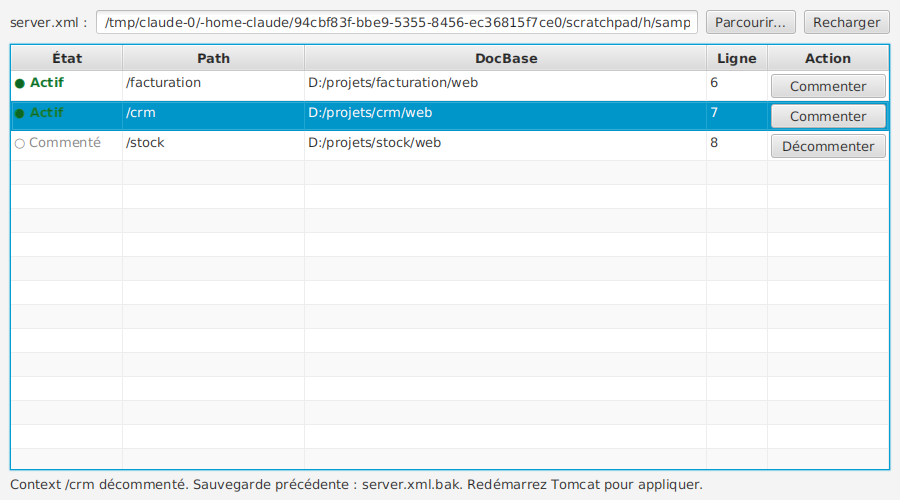

# Tomcat Chooser

Petite application Windows (JavaFX, Java 26) qui liste les `<Context>` d'un `server.xml`
Tomcat et permet de les **commenter / décommenter d'un clic**.



## Fonctionnement

- Au démarrage, le fichier ouvert est `C:\Tomcat70\conf\server.xml`
  (ou le dernier fichier choisi, mémorisé automatiquement).
- **Parcourir…** permet de choisir un autre `server.xml` ; on peut aussi taper le chemin puis Entrée.
- Chaque ligne affiche le nom de l'application (le `path` sans le `/`, ou ROOT) et un bouton d'état : **Actif** (vert) ou **Inactif** (gris).
- Cliquer sur **Actif** commente le Context entier dans un seul bloc `<!-- … -->` ;
  cliquer sur **Inactif** le décommente (y compris un bloc `<!-- … -->` sur plusieurs lignes).
- La fenêtre s'ajuste pour afficher toutes les lignes, sans dépasser la taille de l'écran.
- Le champ **Rechercher** filtre la liste sur le nom de l'application.
- En bas à droite, un voyant indique si **Tomcat est démarré ou arrêté** (vérifié toutes les 3 s).
  Il teste sur localhost le port d'arrêt (`<Server port=…>`) et le port HTTP du `server.xml` choisi,
  quel que soit le lanceur (Eclipse, startup.bat, service).
- Un **double-clic** sur une ligne ouvre une fenêtre pour modifier les attributs du Context
  (path, docBase, reloadable, workDir…) et ceux de ses éléments `<Logger>` et `<Loader>` :
  modifier une valeur, supprimer (✕) ou ajouter un attribut. Les valeurs true/false sont des boutons.
  Cela fonctionne aussi pour un Context inactif (commenté).
- Seule la zone du Context change : indentation, autres commentaires, fins de ligne et encodage
  du fichier sont conservés.
- À la première modification, `server.xml.orig` est créé (copie du fichier d'origine, jamais écrasée).
- L'application refuse d'écrire si le résultat n'est plus du XML valide, et recharge la liste
  si le fichier a été modifié à la main entre-temps.
- Les Context commentés ligne par ligne (une balise `<!-- <Context …> -->`, puis chaque ligne
  commentée, puis `<!-- </Context> -->`, comme le fait Eclipse) sont reconnus et décommentés ligne
  par ligne.
- Un Context qui contient lui-même un commentaire (`<!-- -->`) ne peut pas être commenté
  automatiquement (XML interdit les commentaires imbriqués) : un message l'indique.
- Pensez à redémarrer Tomcat pour que la modification soit prise en compte.
- Si Tomcat est installé dans un dossier protégé (ex. `Program Files`), lancez l'application
  en administrateur pour pouvoir écrire le fichier.

## Prérequis (Windows)

- JDK 26 (par exemple Eclipse Temurin 26), avec `JAVA_HOME` défini
- Maven 3.8 ou plus récent

JavaFX est téléchargé automatiquement par Maven (version Windows).

## Lancer depuis les sources

```bat
cd tomcat-chooser
mvn javafx:run
```

## Télécharger l'exe Windows

À chaque commit sur `main`, GitHub Actions construit l'exe sous Windows (workflow « Exe Windows »).
Dans l'onglet **Actions** du dépôt, ouvrez la dernière exécution et téléchargez l'artefact
**TomcatChooser-windows** : c'est un zip contenant `TomcatChooser.exe` et son Java embarqué
(aucune installation de Java n'est nécessaire). Dézippez-le et lancez `TomcatChooser.exe`.

## Construire l'exe Windows soi-même (depuis Eclipse)

1. Clic droit sur le projet > Run As > **Maven build…**
2. Goals : `clean package javafx:jlink exec:exec@jpackage`
3. Onglet **JRE** : choisissez un **JDK 26** (pas un simple JRE : `jpackage` est fourni avec le JDK).
4. Run.

Résultat : `target\dist\TomcatChooser\TomcatChooser.exe`, avec l'icône Tomcat et son propre Java.
Copiez tout le dossier `target\dist\TomcatChooser` sur un autre poste pour l'utiliser : il n'y a
pas besoin d'y installer Java. Pour un installeur `.msi`, il faudrait en plus WiX Toolset.

On peut aussi passer un fichier en argument : `TomcatChooser.exe D:\autre\conf\server.xml`.

## Tests

```bat
mvn test
```

Les tests couvrent la détection des Context (actifs, commentés sur une ou plusieurs lignes),
l'aller-retour commenter/décommenter à l'identique, les sauvegardes, l'encodage ISO-8859-1
et la détection d'une modification externe.

## Structure

```
src/main/java/module-info.java
src/main/java/fr/tomcatchooser/TomcatChooserApp.java   fenêtre JavaFX
src/main/java/fr/tomcatchooser/ServerXml.java          lecture / modification de server.xml
src/main/java/fr/tomcatchooser/ContextEntry.java       un Context trouvé
src/main/resources/fr/tomcatchooser/tomcat-*.png       icône de la fenêtre (logo Apache Tomcat)
src/test/java/fr/tomcatchooser/ServerXmlTest.java      tests JUnit 5
packaging/tomcat.ico                                   icône de l'exécutable (jpackage)
```

Le logo Apache Tomcat est une marque de l'Apache Software Foundation, repris du dépôt
[apache/tomcat](https://github.com/apache/tomcat) (licence Apache 2.0).
